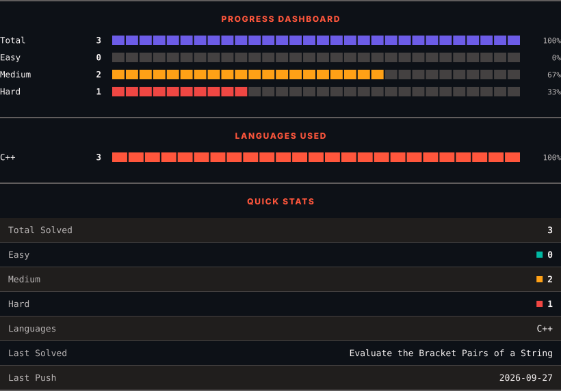
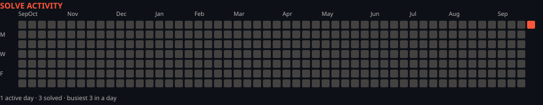

<h1>LeetCode Solutions</h1>

<em>Automatically synced with every accepted submission</em>

   

<picture>
  <source media="(prefers-color-scheme: dark)" srcset=".leetsync/stats-dark.svg">
  <source media="(prefers-color-scheme: light)" srcset=".leetsync/stats-light.svg">
  
</picture>

<picture>
  <source media="(prefers-color-scheme: dark)" srcset=".leetsync/calendar-dark.svg">
  <source media="(prefers-color-scheme: light)" srcset=".leetsync/calendar-light.svg">
  
</picture>

---

### ALL SOLUTIONS

| # | Problem | Difficulty | Language | Date |
|:---:|:--------|:----------:|:--------:|:----:|
| 20 | [Valid Parentheses](problems/0020-Valid-Parentheses) | 🟩 Easy | `C++` | 2026-10-01 |
| 26 | [Remove Duplicates from Sorted Array](problems/0026-Remove-Duplicates-from-Sorted-Array) | 🟩 Easy | `C++` | 2026-09-28 |
| 115 | [Distinct Subsequences](problems/0115-Distinct-Subsequences) | 🟥 Hard | `C++` | 2026-09-27 |
| 167 | [Two Sum II - Input Array Is Sorted](problems/0167-Two-Sum-II---Input-Array-Is-Sorted) | 🟧 Medium | `C++` | 2026-09-28 |
| 1111 | [Maximum Nesting Depth of Two Valid Parentheses Strings](problems/1111-Maximum-Nesting-Depth-of-Two-Valid-Parentheses-Strings) | 🟧 Medium | `C++` | 2026-09-30 |
| 1190 | [Reverse Substrings Between Each Pair of Parentheses](problems/1190-Reverse-Substrings-Between-Each-Pair-of-Parentheses) | 🟧 Medium | `C++` | 2026-09-27 |
| 1614 | [Maximum Nesting Depth of the Parentheses](problems/1614-Maximum-Nesting-Depth-of-the-Parentheses) | 🟩 Easy | `C++` | 2026-09-28 |
| 1807 | [Evaluate the Bracket Pairs of a String](problems/1807-Evaluate-the-Bracket-Pairs-of-a-String) | 🟧 Medium | `C++` | 2026-09-27 |

---

Auto-synced by <strong>LeetSync</strong> · Built by <a href="https://deveshsamant.in/">Devesh Samant</a>

