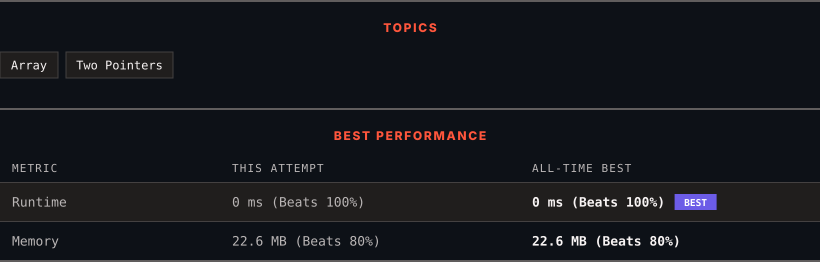

<div align="center">

# 26. Remove Duplicates from Sorted Array

      

[](https://leetcode.com/problems/remove-duplicates-from-sorted-array/)

</div>

---

<div align="center">

<picture>
  <source media="(prefers-color-scheme: dark)" srcset="panel-dark.svg">
  <source media="(prefers-color-scheme: light)" srcset="panel-light.svg">
  
</picture>

</div>

> **New personal best** — Runtime improved on this submission.

### HOW IT WENT

| | |
|:--|:--|
| **Attempts** | first try |
| **Time to solve** | 36 min |
| **Verdicts** | ✅ Accepted |

---

### NOTES

_No notes yet._

---

### SOLUTIONS (1)

| # | File | Language | Date |
|:-:|------|:--------:|:----:|
| 1 | [sol1.cpp](./sol1.cpp) | `C++` | 2026-09-28 ← **latest** |

---

### PROBLEM DESCRIPTION

Given an integer array `nums` sorted in **non-decreasing order**, remove the duplicates [**in-place**](https://en.wikipedia.org/wiki/In-place_algorithm) such that each unique element appears only **once**. The **relative order** of the elements should be kept the **same**.

Consider the number of *unique elements* in `nums` to be `k**​​​​​​​**`​​​​​​​. After removing duplicates, return the number of unique elements `k`.

The first `k` elements of `nums` should contain the unique numbers in **sorted order**. The remaining elements beyond index `k - 1` can be ignored.

**Custom Judge:**

The judge will test your solution with the following code:

```

int[] nums = [...]; // Input array
int[] expectedNums = [...]; // The expected answer with correct length

int k = removeDuplicates(nums); // Calls your implementation

assert k == expectedNums.length;
for (int i = 0; i < k; i++) {
    assert nums[i] == expectedNums[i];
}

```

If all assertions pass, then your solution will be **accepted**.

 

**Example 1:**

```

**Input:** nums = [1,1,2]
**Output:** 2, nums = [1,2,_]
**Explanation:** Your function should return k = 2, with the first two elements of nums being 1 and 2 respectively.
It does not matter what you leave beyond the returned k (hence they are underscores).

```

**Example 2:**

```

**Input:** nums = [0,0,1,1,1,2,2,3,3,4]
**Output:** 5, nums = [0,1,2,3,4,_,_,_,_,_]
**Explanation:** Your function should return k = 5, with the first five elements of nums being 0, 1, 2, 3, and 4 respectively.
It does not matter what you leave beyond the returned k (hence they are underscores).

```

 

**Constraints:**

	- `1 <= nums.length <= 3 * 10^4`

	- `-100 <= nums[i] <= 100`

	- `nums` is sorted in **non-decreasing** order.

---

<div align="center">

<sub>Auto-synced by <strong>LeetSync</strong> · Built by <a href="https://deveshsamant.in/">Devesh Samant</a></sub>

</div>
