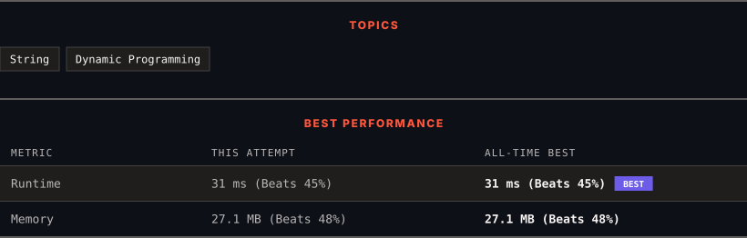

<div align="center">

# 115. Distinct Subsequences

      

[](https://leetcode.com/problems/distinct-subsequences/)

</div>

---

<div align="center">

<picture>
  <source media="(prefers-color-scheme: dark)" srcset="panel-dark.svg">
  <source media="(prefers-color-scheme: light)" srcset="panel-light.svg">
  
</picture>

</div>

> **New personal best** — Runtime improved on this submission.

### HOW IT WENT

| | |
|:--|:--|
| **Attempts** | 3 before accepted |
| **Time to solve** | 3 min |
| **Verdicts** | 💥 Runtime Error → 💥 Runtime Error → ✅ Accepted |

---

### NOTES

_No notes yet._

---

### SOLUTIONS (1)

| # | File | Language | Date |
|:-:|------|:--------:|:----:|
| 1 | [sol1.cpp](./sol1.cpp) | `C++` | 2026-09-27 ← **latest** |

---

### PROBLEM DESCRIPTION

Given two strings s and t, return *the number of distinct* ***subsequences**** of *s* which equals *t.

The test cases are generated so that the answer fits on a 32-bit signed integer.

 

**Example 1:**

```

**Input:** s = "rabbbit", t = "rabbit"
**Output:** 3
**Explanation:**
As shown below, there are 3 ways you can generate "rabbit" from s.
`**rabb**b**it**`
`**ra**b**bbit**`
`**rab**b**bit**`

```

**Example 2:**

```

**Input:** s = "babgbag", t = "bag"
**Output:** 5
**Explanation:**
As shown below, there are 5 ways you can generate "bag" from s.
`**ba**b**g**bag`
`**ba**bgba**g**`
`**b**abgb**ag**`
`ba**b**gb**ag**`
`babg**bag**`
```

 

**Constraints:**

	- `1 <= s.length, t.length <= 1000`

	- `s` and `t` consist of English letters.

---

<div align="center">

<sub>Auto-synced by <strong>LeetSync</strong> · Built by <a href="https://deveshsamant.in/">Devesh Samant</a></sub>

</div>
