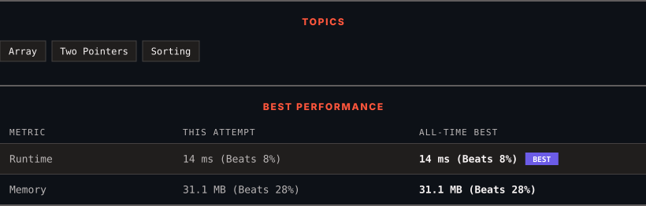

<div align="center">

# 977. Squares of a Sorted Array

      

[](https://leetcode.com/problems/squares-of-a-sorted-array/)

</div>

---

<div align="center">

<picture>
  <source media="(prefers-color-scheme: dark)" srcset="panel-dark.svg">
  <source media="(prefers-color-scheme: light)" srcset="panel-light.svg">
  
</picture>

</div>

> **New personal best** — Runtime improved on this submission.

### HOW IT WENT

| | |
|:--|:--|
| **Attempts** | 2 before accepted |
| **Time to solve** | 12 min |
| **Verdicts** | 💥 Runtime Error → ✅ Accepted |

---

### NOTES

_No notes yet._

---

### SOLUTIONS (1)

| # | File | Language | Date |
|:-:|------|:--------:|:----:|
| 1 | [sol1.cpp](./sol1.cpp) | `C++` | 2026-10-05 ← **latest** |

---

### PROBLEM DESCRIPTION

Given an integer array `nums` sorted in **non-decreasing** order, return *an array of **the squares of each number** sorted in non-decreasing order*.

 

**Example 1:**

```

**Input:** nums = [-4,-1,0,3,10]
**Output:** [0,1,9,16,100]
**Explanation:** After squaring, the array becomes [16,1,0,9,100].
After sorting, it becomes [0,1,9,16,100].

```

**Example 2:**

```

**Input:** nums = [-7,-3,2,3,11]
**Output:** [4,9,9,49,121]

```

 

**Constraints:**

	- `1 <= nums.length <= 10^4`

	- `-10^4 <= nums[i] <= 10^4`

	- `nums` is sorted in **non-decreasing** order.

 

**Follow up:** Squaring each element and sorting the new array is very trivial, could you find an `O(n)` solution using a different approach?

---

<div align="center">

<sub>Auto-synced by <strong>LeetSync</strong> · Built by <a href="https://deveshsamant.in/">Devesh Samant</a></sub>

</div>
