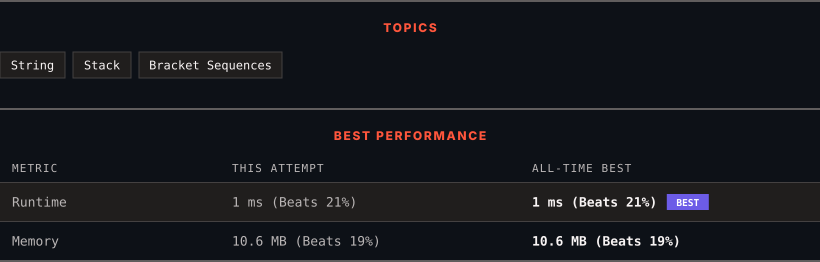

<div align="center">

# 1111. Maximum Nesting Depth of Two Valid Parentheses Strings

      

[](https://leetcode.com/problems/maximum-nesting-depth-of-two-valid-parentheses-strings/)

</div>

---

<div align="center">

<picture>
  <source media="(prefers-color-scheme: dark)" srcset="panel-dark.svg">
  <source media="(prefers-color-scheme: light)" srcset="panel-light.svg">
  
</picture>

</div>

> **New personal best** — Runtime improved on this submission.

### HOW IT WENT

| | |
|:--|:--|
| **Attempts** | first try |
| **Time to solve** | 1 min |
| **Verdicts** | ✅ Accepted |

---

### NOTES

_No notes yet._

---

### SOLUTIONS (1)

| # | File | Language | Date |
|:-:|------|:--------:|:----:|
| 1 | [sol1.cpp](./sol1.cpp) | `C++` | 2026-09-30 ← **latest** |

---

### PROBLEM DESCRIPTION

A string is a *valid parentheses string* (denoted VPS) if and only if it consists of `"("` and `")"` characters only, and:

	- It is the empty string, or

	- It can be written as `AB` (`A` concatenated with `B`), where `A` and `B` are VPS's, or

	- It can be written as `(A)`, where `A` is a VPS.

We can similarly define the *nesting depth* `depth(S)` of any VPS `S` as follows:

	- `depth("") = 0`

	- `depth(A + B) = max(depth(A), depth(B))`, where `A` and `B` are VPS's

	- `depth("(" + A + ")") = 1 + depth(A)`, where `A` is a VPS.

For example, `""`, `"()()"`, and `"()(()())"` are VPS's (with nesting depths 0, 1, and 2), and `")("` and `"(()"` are not VPS's.

Given a VPS seq, split it into two disjoint subsequences `A` and `B`, such that `A` and `B` are VPS's (and `A.length + B.length = seq.length`). The subsequences may not necessarily be contiguous.

For example, for the sequence `123456789`, one possible split is:

	- 
	`A = {1, 3, 5, 7, 9}`,

	

	- 
	`B = {2, 4, 6, 8}`.

	

This corresponds to the output `[0, 1, 0, 1, 0, 1, 0, 1, 0]`  where 0 indicates membership in `A` and 1 indicates membership in `B`.

Now choose **any** such `A` and `B` such that `max(depth(A), depth(B))` is the minimum possible value.

Return an `answer` array (of length `seq.length`) that encodes such a choice of `A` and `B`:  `answer[i] = 0` if `seq[i]` is part of `A`, else `answer[i] = 1`.  Note that even though multiple answers may exist, you may return any of them.

 

**Example 1:**

```

**Input:** seq = "(()())"
**Output:** [0,1,1,1,1,0]

```

**Example 2:**

```

**Input:** seq = "()(())()"
**Output:** [0,0,0,1,1,0,1,1]

```

 

**Constraints:**

	- `1 <= seq.size <= 10000`

---

<div align="center">

<sub>Auto-synced by <strong>LeetSync</strong> · Built by <a href="https://deveshsamant.in/">Devesh Samant</a></sub>

</div>
