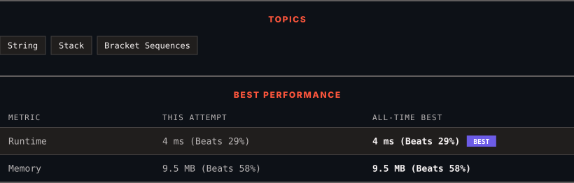

<div align="center">

# 1190. Reverse Substrings Between Each Pair of Parentheses

      

[](https://leetcode.com/problems/reverse-substrings-between-each-pair-of-parentheses/)

</div>

---

<div align="center">

<picture>
  <source media="(prefers-color-scheme: dark)" srcset="panel-dark.svg">
  <source media="(prefers-color-scheme: light)" srcset="panel-light.svg">
  
</picture>

</div>

> **New personal best** — Runtime improved on this submission.

### HOW IT WENT

| | |
|:--|:--|
| **Attempts** | first try |
| **Time to solve** | 5 min |
| **Verdicts** | ✅ Accepted |

---

### NOTES

_No notes yet._

---

### SOLUTIONS (1)

| # | File | Language | Date |
|:-:|------|:--------:|:----:|
| 1 | [sol1.cpp](./sol1.cpp) | `C++` | 2026-09-27 ← **latest** |

---

### PROBLEM DESCRIPTION

You are given a string `s` that consists of lower case English letters and brackets.

Reverse the strings in each pair of matching parentheses, starting from the innermost one.

Your result should **not** contain any brackets.

 

**Example 1:**

```

**Input:** s = "(abcd)"
**Output:** "dcba"

```

**Example 2:**

```

**Input:** s = "(u(love)i)"
**Output:** "iloveu"
**Explanation:** The substring "love" is reversed first, then the whole string is reversed.

```

**Example 3:**

```

**Input:** s = "(ed(et(oc))el)"
**Output:** "leetcode"
**Explanation:** First, we reverse the substring "oc", then "etco", and finally, the whole string.

```

 

**Constraints:**

	- `1 <= s.length <= 2000`

	- `s` only contains lower case English characters and parentheses.

	- It is guaranteed that all parentheses are balanced.

---

<div align="center">

<sub>Auto-synced by <strong>LeetSync</strong> · Built by <a href="https://deveshsamant.in/">Devesh Samant</a></sub>

</div>
