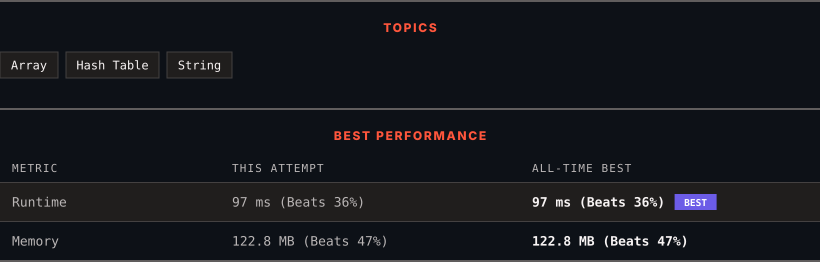

<div align="center">

# 1807. Evaluate the Bracket Pairs of a String

      

[](https://leetcode.com/problems/evaluate-the-bracket-pairs-of-a-string/)

</div>

---

<div align="center">

<picture>
  <source media="(prefers-color-scheme: dark)" srcset="panel-dark.svg">
  <source media="(prefers-color-scheme: light)" srcset="panel-light.svg">
  
</picture>

</div>

> **New personal best** — Runtime improved on this submission.

### HOW IT WENT

| | |
|:--|:--|
| **Attempts** | first try |
| **Time to solve** | 1 min |
| **Verdicts** | ✅ Accepted |

---

### NOTES

_No notes yet._

---

### SOLUTIONS (1)

| # | File | Language | Date |
|:-:|------|:--------:|:----:|
| 1 | [sol1.cpp](./sol1.cpp) | `C++` | 2026-09-27 ← **latest** |

---

### PROBLEM DESCRIPTION

You are given a string `s` that contains some bracket pairs, with each pair containing a **non-empty** key.

	- For example, in the string `"(name)is(age)yearsold"`, there are **two** bracket pairs that contain the keys `"name"` and `"age"`.

You know the values of a wide range of keys. This is represented by a 2D string array `knowledge` where each `knowledge[i] = [key_i, value_i]` indicates that key `key_i` has a value of `value_i`.

You are tasked to evaluate **all** of the bracket pairs. When you evaluate a bracket pair that contains some key `key_i`, you will:

	- Replace `key_i` and the bracket pair with the key's corresponding `value_i`.

	- If you do not know the value of the key, you will replace `key_i` and the bracket pair with a question mark `"?"` (without the quotation marks).

Each key will appear at most once in your `knowledge`. There will not be any nested brackets in `s`.

Return *the resulting string after evaluating **all** of the bracket pairs.*

 

**Example 1:**

```

**Input:** s = "(name)is(age)yearsold", knowledge = [["name","bob"],["age","two"]]
**Output:** "bobistwoyearsold"
**Explanation:**
The key "name" has a value of "bob", so replace "(name)" with "bob".
The key "age" has a value of "two", so replace "(age)" with "two".

```

**Example 2:**

```

**Input:** s = "hi(name)", knowledge = [["a","b"]]
**Output:** "hi?"
**Explanation:** As you do not know the value of the key "name", replace "(name)" with "?".

```

**Example 3:**

```

**Input:** s = "(a)(a)(a)aaa", knowledge = [["a","yes"]]
**Output:** "yesyesyesaaa"
**Explanation:** The same key can appear multiple times.
The key "a" has a value of "yes", so replace all occurrences of "(a)" with "yes".
Notice that the "a"s not in a bracket pair are not evaluated.

```

 

**Constraints:**

	- `1 <= s.length <= 10^5`

	- `0 <= knowledge.length <= 10^5`

	- `knowledge[i].length == 2`

	- `1 <= key_i.length, value_i.length <= 10`

	- `s` consists of lowercase English letters and round brackets `'('` and `')'`.

	- Every open bracket `'('` in `s` will have a corresponding close bracket `')'`.

	- The key in each bracket pair of `s` will be non-empty.

	- There will not be any nested bracket pairs in `s`.

	- `key_i` and `value_i` consist of lowercase English letters.

	- Each `key_i` in `knowledge` is unique.

---

<div align="center">

<sub>Auto-synced by <strong>LeetSync</strong> · Built by <a href="https://deveshsamant.in/">Devesh Samant</a></sub>

</div>
